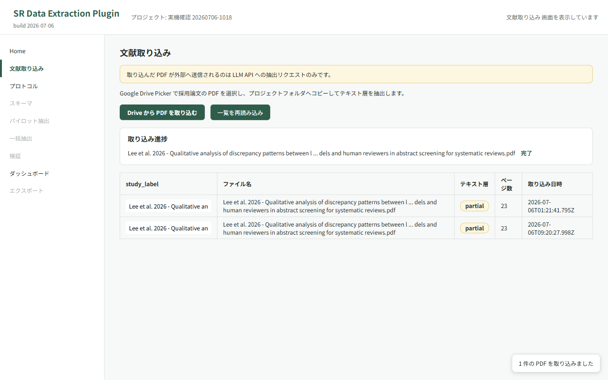
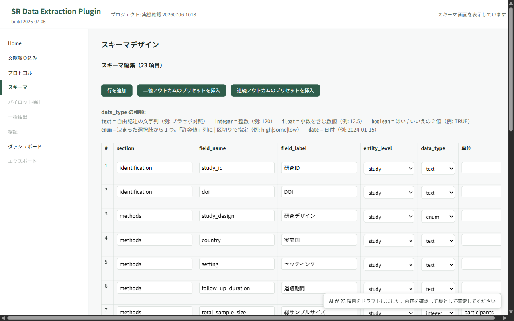
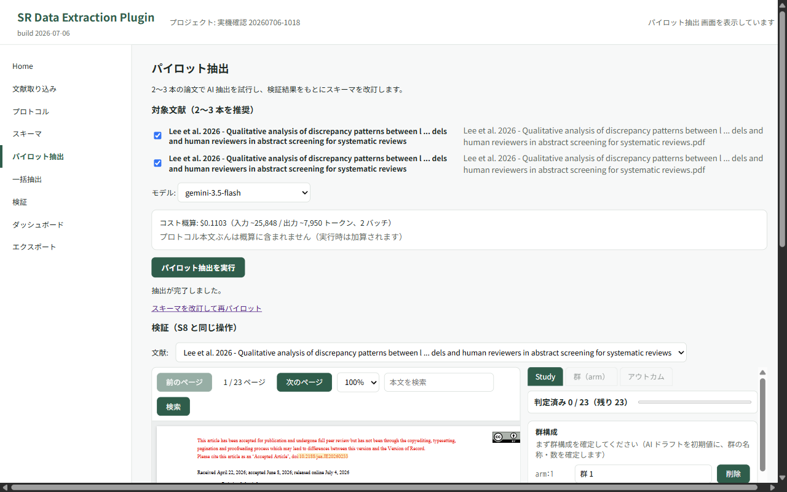
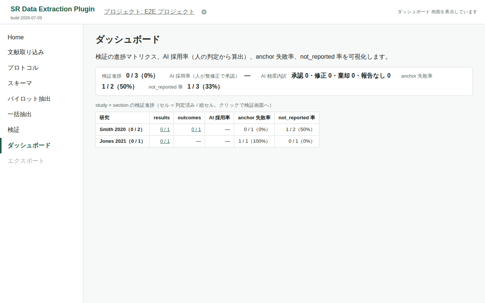
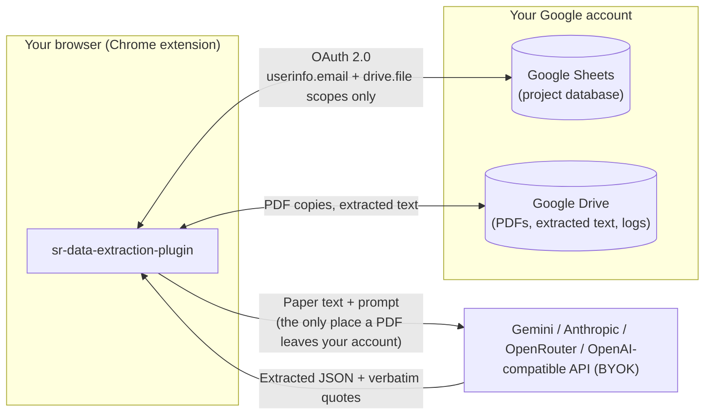

[日本語](README.md) | **English**

# sr-data-extraction-plugin

> The [Japanese README](README.md) is canonical. This page summarizes it for English-speaking readers. The three sections most likely to drift are "What it does", "Data flow", and "Setup for users"; a pull request that changes any of them in the Japanese README also updates the corresponding section here.

An MIT-licensed, open-source Chrome extension that supports the **data extraction stage** of systematic reviews (SR) and scoping reviews. It is the third tool in a trilogy for SR workflows: [sr-query-builder](https://github.com/youkiti/sr-query-builder-plugin) (search strategy) → [tiab-review](https://github.com/youkiti/tiab-review-plugin) (screening) → this extension (data extraction).

> **Status**: Published on the Chrome Web Store since v0.1.0 (2026-07-12) and updated continuously since. Screens S1–S12 are implemented (the MVP S1–S10 plus Options, risk-of-bias templates, independent dual review, and the S12 adjudication screen). The canonical specification is [docs/requirements.md](docs/requirements.md) (Japanese); remaining work is tracked in [docs/remaining-work-plan.md](docs/remaining-work-plan.md) and in GitHub issues.

> **📦 Install**: [Chrome Web Store listing](https://chromewebstore.google.com/detail/sr-data-extraction-plugin/ibpbkgffgkmdmflamhadbcfjgfljjgip) → "Add to Chrome".

> **📖 User guide (English)**: [https://youkiti.github.io/sr-data-extraction-plugin/help.html?lang=en](https://youkiti.github.io/sr-data-extraction-plugin/help.html?lang=en), including a walkthrough video. See also the [landing page](https://youkiti.github.io/sr-data-extraction-plugin/?lang=en), [privacy policy](https://youkiti.github.io/sr-data-extraction-plugin/privacy-policy.html?lang=en), and [terms of service](https://youkiti.github.io/sr-data-extraction-plugin/terms-of-service.html?lang=en). The page sources live in [hosted/](hosted/).

## What it does

1. From the **included full-text PDFs** stored in your Google Drive and your review protocol, an LLM drafts the extraction schema (coding sheet).
2. The LLM extracts data from every study according to the schema and attaches a **verbatim quote** (the supporting passage) to each value.
3. The extension locates each quote in the PDF and **highlights it** in a PDF.js viewer.
4. Reviewers inspect the highlight and make the final call for each value: **accept / edit / reject / not_reported**. Every decision is written to an append-only audit trail.
5. Confirmed data are exported as **CSV** (three layouts: study_wide / results_long / audit) plus an **R-ready set** (tab1 / ma / rob / data_dictionary).

The goal is to make "AI pre-extraction + human verification" methodologically defensible end to end, with a complete audit trail and built-in safeguards against automation bias.

Beyond the core loop, the extension provides:

- **Study / document model**: several reports of one trial (main paper, registry record, protocol paper, conference abstract) can be grouped into a single study; quotes are anchored per document, and extraction, verification, and export work per study.
- **Risk-of-bias templates** (RoB 2, ROBINS-I) inserted as schema presets, with a dedicated `rob_domain` entity level.
- **Independent dual review and adjudication**: a second reviewer can extract blind to the AI output, disagreements are resolved on the S12 adjudication screen, and agreement rates with Cohen's κ are computed on demand.
- **Automation-bias safeguards**: human cells start empty, even *accept* requires an explicit action, and exports warn about unverified cells.
- **Numeric consistency checks**, a copy-ready **Methods paragraph** for your manuscript, batch extraction with an offline queue and retry, a progress dashboard (verification progress, AI acceptance rate, anchor failure rate, not_reported rate), and an English / Japanese UI.

> There is no limit on the number of schema fields. The "suggest roughly 10–40 items" instruction inside the drafting prompt only guides how many fields the AI proposes at once; you can add as many as you need.

## Screenshots

The flow is: import → schema design → verification → progress dashboard. Images use test data only.

| S3 Import documents | S5 Design schema |
|---|---|
| [](docs/store/screenshots/s3-documents.png) | [](docs/store/screenshots/s5-schema.png) |
| Pick included PDFs (or a whole folder) with the Google Drive Picker; the text layer is extracted on import. | The AI drafts a coding sheet from the protocol; you finalize it in a table editor. |

| S8 Verify (evidence highlight) | S9 Dashboard |
|---|---|
| [](docs/store/screenshots/s8-verify-highlight.png) | [](docs/store/screenshots/s9-dashboard.png) |
| The AI's quote is highlighted in the PDF viewer; decide accept / edit / reject / not_reported. | Verification progress by study × section, AI acceptance rate, anchor failure rate, not_reported rate. |

## Data flow (serverless)

There is no server operated by the developers. Data move only between your own Google Drive / Sheets and the LLM API you contract with your own key (BYOK).



- The OAuth scopes are `userinfo.email` (the signed-in address, used to attribute decisions in the audit trail) and `drive.file` only. With `drive.file` the extension can access **only files you explicitly pick in the Picker and files it created itself**. The project database in Sheets is read and written within that scope; no Drive-wide or all-spreadsheets scope is requested.
- PDFs leave your Google account only as part of extraction requests to the LLM API. Born-digital PDFs are sent as extracted text (`text_only`); scanned PDFs without a text layer are sent as page images (`pdf_native`), chosen automatically per document.
- Text and data mining for academic research is treated as lawful under the copyright exceptions applicable to the project (e.g. Article 30-4 of the Japanese Copyright Act); see [docs/requirements.md §1.5](docs/requirements.md).

## Setup for users

No build tools are needed. Install from the Chrome Web Store, then connect your own Google account and LLM API key.

1. **Install**: open the [Chrome Web Store listing](https://chromewebstore.google.com/detail/sr-data-extraction-plugin/ibpbkgffgkmdmflamhadbcfjgfljjgip) and click "Add to Chrome".
2. **Configure an LLM provider** on the extension's Options page. Supported: **Gemini** (API key from [Google AI Studio](https://aistudio.google.com/apikey)), **Anthropic**, **OpenRouter**, **Azure OpenAI**, and any **OpenAI-compatible Chat Completions API** (full URL + key). OpenAI-compatible endpoints may be HTTPS or a local LLM on `http://localhost`, `http://127.0.0.1`, or `http://[::1]`; the key is optional for loopback. For an HTTP API on another machine, expose it over HTTPS with [Tailscale Serve](https://tailscale.com/docs/features/tailscale-serve) or [Cloudflare Tunnel](https://developers.cloudflare.com/cloudflare-one/networks/connectors/cloudflare-tunnel/) rather than connecting directly. Anthropic, OpenRouter, and OpenAI-compatible providers can fetch their model list automatically; a connection test with structured output is available. Keys are stored in the browser only and never sent to the developers.
3. **Connect Google (OAuth consent)**: click "Sign in" in the popup and grant access to your **email address** and **Drive (selected files only)**. Only the `userinfo.email` and `drive.file` scopes are requested.
4. You can now create a project → import PDFs → draft the schema → run extraction → verify → export CSV.

> For step-by-step instructions see the [user guide](https://youkiti.github.io/sr-data-extraction-plugin/help.html?lang=en); for privacy details see the [privacy policy](https://youkiti.github.io/sr-data-extraction-plugin/privacy-policy.html?lang=en).

## Methodological features at a glance

- Every AI value carries a verbatim quote; quotes are anchored to the PDF text layer through exact → normalized → fuzzy matching, and the anchoring outcome (`anchor_status`) is recorded per quote. A technical spike measured a 96.2% anchoring success rate ([experiments/anchor-spike/REPORT.md](experiments/anchor-spike/REPORT.md), Japanese).
- Data rows are keyed by annotator (`ai` / `human_with_ai` / `human_independent` / `consensus`), so single-reviewer verification and independent dual extraction share one data model.
- Decisions are append-only; the `audit` CSV reconstructs who decided what, when, and on which evidence.
- Verification starts from empty human cells; accepting requires an explicit action; exports flag unverified cells.
- Schema, protocol, and extraction runs are versioned, so results stay tied to the schema version they were produced under.
- The export screen offers a Methods paragraph (English or Japanese, single-reviewer or dual-review variant) aligned with PRISMA 2020 item 9.

## Development

Requires Node.js ≥ 18. These steps are for building from source; ordinary users do not need them.

```bash
git clone https://github.com/youkiti/sr-data-extraction-plugin
cd sr-data-extraction-plugin
npm install
cp .env.example .env   # set WEBAUTH_CLIENT_ID (Web application OAuth client); may stay empty for a dev build without sign-in
npm run dev            # development build into dist/
```

Load `dist/` via `chrome://extensions` → Developer mode → "Load unpacked".

| Command | Purpose |
|---|---|
| `npm run dev` / `npm run watch` | Development build / watch build |
| `npm run build` | Production build |
| `npm run typecheck` / `npm run lint` / `npm run lint:css` | TypeScript, ESLint, stylelint |
| `npm test` | jest (100% line and branch coverage of `src/` is enforced) |
| `npm run test:e2e` | Playwright end-to-end tests (serves `dist/` with a chrome stub; see [docs/test-strategy.md](docs/test-strategy.md)) |
| `npm run build:demo` | Demo build with mock data from three fictional papers, used for recording |
| `npm run release` / `npm run pack:release` | Release automation (requires PowerShell `pwsh`; see [tools/release/](tools/release/)) |

The E2E suite uses a local Chromium: run `npx playwright install chromium`, or point at an existing binary with `PLAYWRIGHT_CHROMIUM_PATH=/path/to/chrome npm run test:e2e`.

Contribution conventions (branching, Japanese-language commit messages and docs, test protection, shared hotspot files) are in [CLAUDE.md](CLAUDE.md) (Japanese).

## Documentation

All documents below are written in Japanese.

| Document | Content |
|---|---|
| [docs/requirements.md](docs/requirements.md) | Requirements specification: data design (Sheets tabs, study / document model, annotator axis), functional requirements S1–S12, quote anchoring method |
| [docs/ui-flow.md](docs/ui-flow.md) | Screen flow |
| [docs/architecture.md](docs/architecture.md) | Directory layout, build, and test policy |
| [docs/ui-states.md](docs/ui-states.md) | UI state matrix (target spec) |
| [docs/test-strategy.md](docs/test-strategy.md) | Test strategy: jest 100% + Playwright, PDF fixtures, CI |
| [docs/remaining-work-plan.md](docs/remaining-work-plan.md) | Remaining work and the list of items that need manual / real-API testing |
| [docs/manual-testing.md](docs/manual-testing.md) | Manual end-to-end test scenarios and results |
| [docs/methods-boilerplate.md](docs/methods-boilerplate.md) | Methods paragraph templates (English and Japanese) |
| [hosted/README.md](hosted/README.md) | Deployment of the public pages (GitHub Pages) |
| [experiments/anchor-spike/REPORT.md](experiments/anchor-spike/REPORT.md) | Technical spike on quote anchoring (96.2% success) |

## Citation and funding

A preprint describing the tool and its evaluation is planned (see [issue #258](https://github.com/youkiti/sr-data-extraction-plugin/issues/258)). Until it is available, please cite the repository and the version you used:

> youkiti. sr-data-extraction-plugin (version X.Y.Z) [Chrome extension]. https://github.com/youkiti/sr-data-extraction-plugin

The installed version is shown in `chrome://extensions`. A copy-ready Methods paragraph for your manuscript is available on the export screen.

This work was supported by JSPS KAKENHI Grant Number 25K13585.

## License

[MIT](LICENSE). Third-party notices are listed in [THIRD_PARTY_NOTICES.md](THIRD_PARTY_NOTICES.md).
