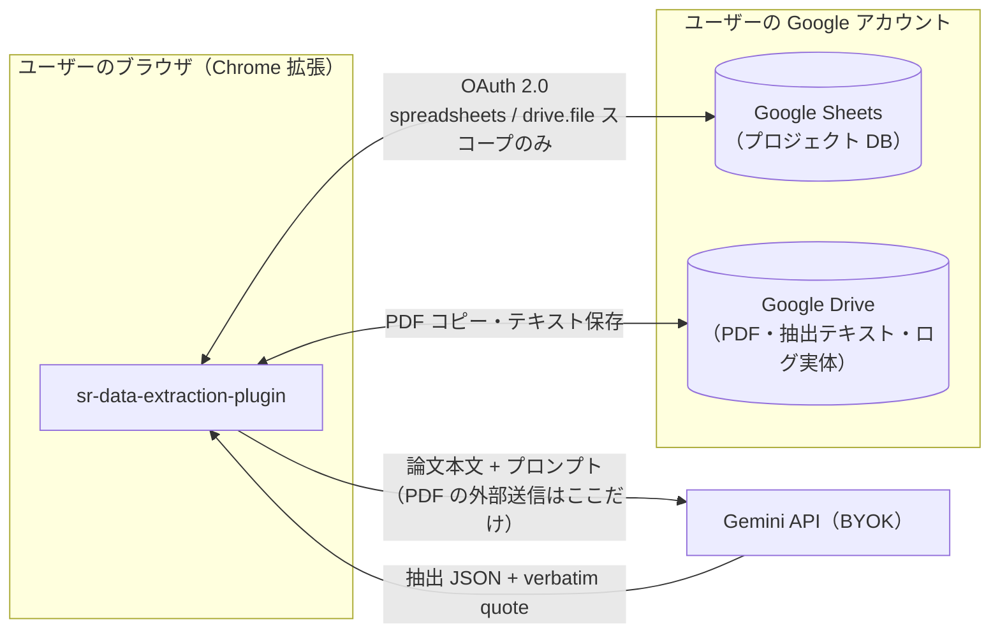

# sr-data-extraction-plugin

システマティックレビュー（SR）／スコーピングレビューの**データ抽出工程**を支援する、MIT ライセンスの OSS Chrome 拡張です。SR ツール群 3 部作（[sr-query-builder](https://github.com/youkiti/sr-query-builder-plugin) → [tiab-review](https://github.com/youkiti/tiab-review-plugin) → 本拡張）の 3 作目にあたります。

> **開発ステータス**: スケルトン段階（要件定義完了・画面実装はこれから）。正典ドキュメントは [docs/requirements.md](docs/requirements.md) を起点に参照してください。

## なにをするツールか

1. Google Drive 上の**著作権フリー（OA / パブリックドメイン）採用論文 PDF** と研究プロトコルから、AI が抽出スキーマ（コーディングシート）をドラフト
2. AI が各論文からスキーマに沿ってデータを抽出し、各値に**根拠となる本文箇所（verbatim quote）**を付与
3. PDF.js ビューア上で根拠箇所を**ハイライト表示**
4. 研究者がハイライトを目視確認しながら **accept / edit / reject / not_reported** で最終判定（全判断の監査証跡を記録）
5. 確定データを **CSV エクスポート**（study_wide / results_long / audit の 3 形式）

「AI 事前抽出 + 人間検証」を方法論的に妥当な形（監査証跡・automation bias 対策込み）で完遂できることを狙っています。

## データフロー（サーバーレス構成）

外部サーバーは存在しません。データはユーザー自身の Google Drive / Sheets と、ユーザーが自分の API キーで契約する LLM API（BYOK）の間でのみ流通します。



- OAuth スコープは `spreadsheets` と `drive.file` のみ。`drive.file` により、アクセスできるのは**ユーザーが Picker で明示的に選択したファイルと拡張が作成したファイルだけ**です（Drive 全体を読むスコープは要求しません）
- 取り込む PDF が著作権フリー / 利用許諾済みであることは、ユーザーが取り込み前に確認する運用です（詳細: [docs/requirements.md §1.5](docs/requirements.md)）

## 開発セットアップ

Node.js ≥ 18 が必要です。

```bash
git clone https://github.com/youkiti/sr-data-extraction-plugin
cd sr-data-extraction-plugin
npm install
cp .env.example .env   # OAUTH_CLIENT_ID を設定（dev ビルドだけなら空でも可）
npm run dev            # dist/ に開発ビルドを生成
```

`chrome://extensions` → デベロッパーモード → 「パッケージ化されていない拡張機能を読み込む」で `dist/` を選択します。

### npm スクリプト

| コマンド | 内容 |
|---|---|
| `npm run dev` / `npm run watch` | 開発ビルド（`dist/`）/ 監視ビルド |
| `npm run build` | 本番ビルド |
| `npm run typecheck` | TypeScript 型検査 |
| `npm run lint` / `npm run lint:css` | ESLint / stylelint |
| `npm test` | jest（`src/` の行・分岐カバレッジ 100% を強制） |
| `npm run test:e2e` | Playwright E2E（`dist/` を静的配信 + chrome スタブ。詳細: [docs/test-strategy.md](docs/test-strategy.md)） |

E2E はローカルの chromium を使います。`npx playwright install chromium` するか、既存バイナリを `PLAYWRIGHT_CHROMIUM_PATH=/path/to/chrome npm run test:e2e` で指定してください。

## ドキュメント

| ドキュメント | 内容 |
|---|---|
| [docs/requirements.md](docs/requirements.md) | 要件定義書（データ設計・機能要件・quote アンカリング方式） |
| [docs/ui-flow.md](docs/ui-flow.md) | 画面遷移図 |
| [docs/architecture.md](docs/architecture.md) | ディレクトリ構造・ビルド・テスト方針 |
| [docs/ui-states.md](docs/ui-states.md) | UI 状態マトリクス（target spec + drift 注記） |
| [docs/test-strategy.md](docs/test-strategy.md) | テスト戦略（jest 100% + Playwright、PDF fixture 運用、CI 計画） |
| [experiments/anchor-spike/REPORT.md](experiments/anchor-spike/REPORT.md) | quote アンカリングの技術スパイク結果（anchor 成功率 96.2%） |

## ライセンス・資金

- ライセンス: [MIT](LICENSE)
- 本ツールの開発は JSPS 科研費 **25K13585** の助成を受けています（This work was supported by JSPS KAKENHI Grant Number 25K13585）
