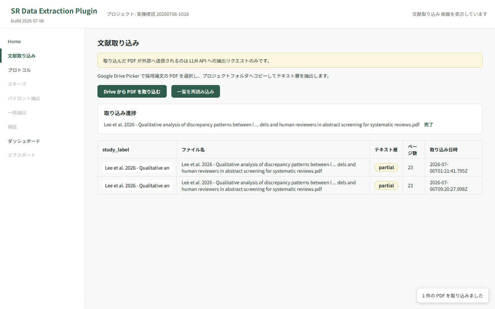
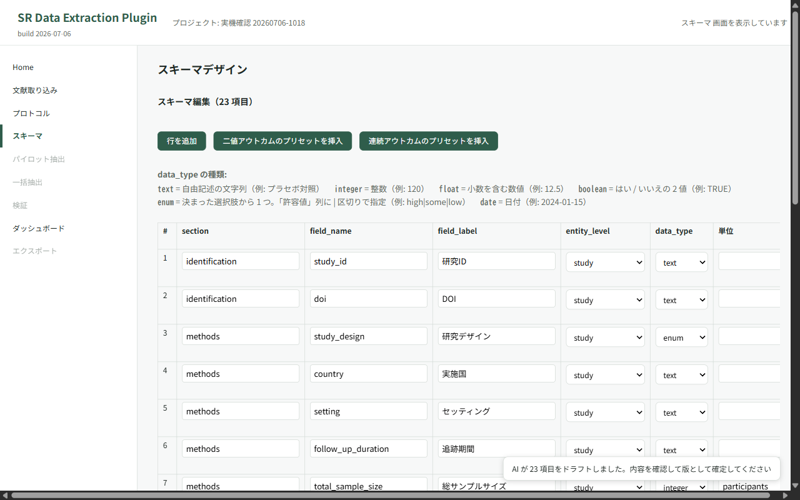
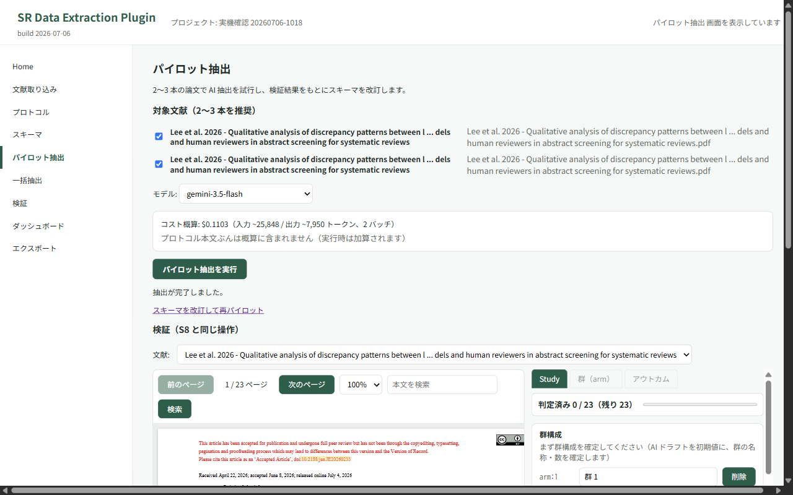
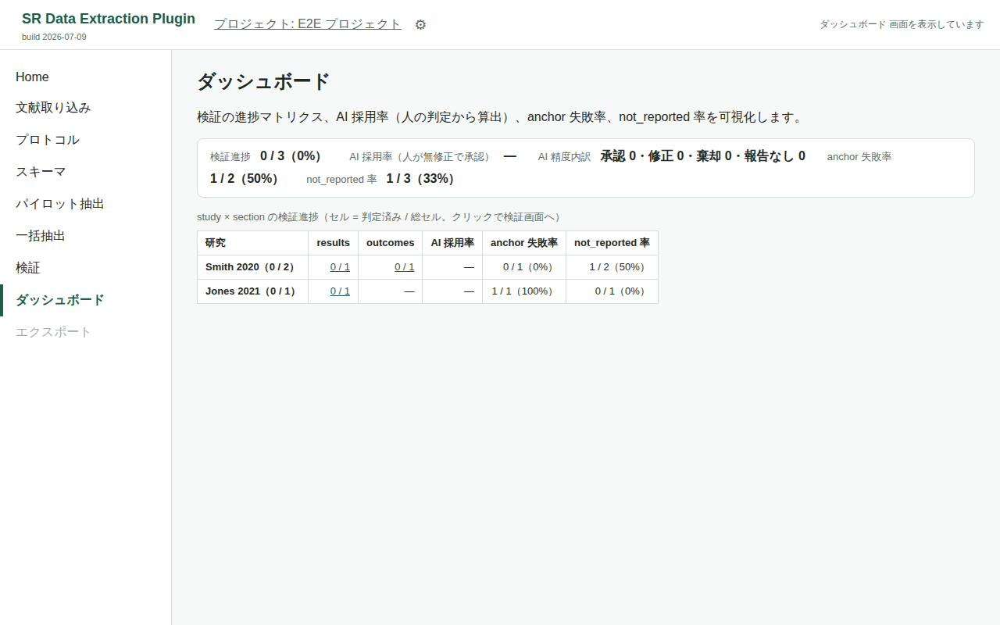
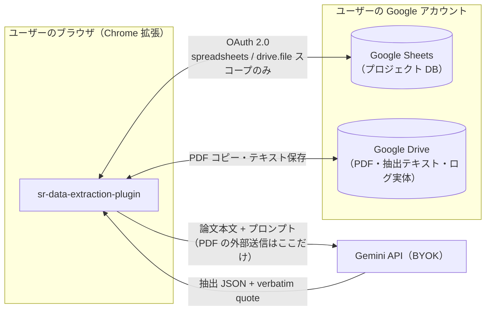

# sr-data-extraction-plugin

システマティックレビュー（SR）／スコーピングレビューの**データ抽出工程**を支援する、MIT ライセンスの OSS Chrome 拡張です。SR ツール群 3 部作（[sr-query-builder](https://github.com/youkiti/sr-query-builder-plugin) → [tiab-review](https://github.com/youkiti/tiab-review-plugin) → 本拡張）の 3 作目にあたります。

> **開発ステータス**: MVP 機能実装済み（S1〜S10。実機通し確認は 2026-07-03 完了）・リリース準備中。正典ドキュメントは [docs/requirements.md](docs/requirements.md) を起点に、残タスクは [docs/remaining-work-plan.md](docs/remaining-work-plan.md) を参照してください。

## なにをするツールか

1. Google Drive 上の**採用論文 PDF** と研究プロトコルから、AI が抽出スキーマ（コーディングシート）をドラフト
2. AI が各論文からスキーマに沿ってデータを抽出し、各値に**根拠となる本文箇所（verbatim quote）**を付与
3. PDF.js ビューア上で根拠箇所を**ハイライト表示**
4. 研究者がハイライトを目視確認しながら **accept / edit / reject / not_reported** で最終判定（全判断の監査証跡を記録）
5. 確定データを **CSV エクスポート**（study_wide / results_long / audit の 3 形式）

「AI 事前抽出 + 人間検証」を方法論的に妥当な形（監査証跡・automation bias 対策込み）で完遂できることを狙っています。

## 画面イメージ

取り込み → スキーマ設計 → 検証 → 進捗ダッシュボードの流れです（画像はテスト用データで、実データは含みません）。

| S3 文献取り込み | S5 スキーマ設計 |
|---|---|
| [](docs/store/screenshots/s3-documents.png) | [](docs/store/screenshots/s5-schema.png) |
| Google Drive Picker で採用論文 PDF（フォルダ単位も可）を取り込み、テキスト層を抽出。 | AI がプロトコルからコーディングシートをドラフトし、表形式エディタで確定。 |

| S8 検証（根拠ハイライト） | S9 ダッシュボード |
|---|---|
| [](docs/store/screenshots/s8-verify-highlight.png) | [](docs/store/screenshots/s9-dashboard.png) |
| PDF ビューア上で AI の根拠 quote をハイライトし、accept / edit / reject / not_reported で判定。 | study × section の検証進捗・AI 採用率・anchor 失敗率・not_reported 率を俯瞰。 |

## データフロー（サーバーレス構成）

外部サーバーは存在しません。データはユーザー自身の Google Drive / Sheets と、ユーザーが自分の API キーで契約する LLM API（BYOK）の間でのみ流通します。



- OAuth スコープは `spreadsheets` と `drive.file` のみ。`drive.file` により、アクセスできるのは**ユーザーが Picker で明示的に選択したファイルと拡張が作成したファイルだけ**です（Drive 全体を読むスコープは要求しません）
- 学術研究目的のデータ抽出（テキスト・データマイニング）は著作権法上の権利制限規定（30 条の 4 等）の範囲内であり適法との整理です。PDF が外部へ送信されるのは LLM API への抽出リクエストのみです（詳細: [docs/requirements.md §1.5](docs/requirements.md)）

## 利用者向けセットアップ

ふだんの利用にビルドや開発ツールは不要です。Chrome ウェブストアからインストールして、ご自身の Google アカウントと LLM API キーを設定するだけで使えます。

1. **インストール**: Chrome ウェブストアの掲載ページ（**限定公開のため、配布されたリンクを知っている人のみインストールできます** — リンクは配布者から受け取ってください）を開き、「Chrome に追加」を押します。
   - ※ 一般公開前は、開発者から共有された限定公開リンクからのみインストールできます。
2. **LLM API キーの設定**: 拡張のオプション画面を開き、ご自身の **Gemini API キー**（または OpenRouter API キー）を保存します。キーはブラウザ内にのみ保存され、外部の開発者サーバーへは送信されません（BYOK）。
   - Gemini API キーは Google AI Studio（<https://aistudio.google.com/apikey>）で取得できます。
3. **Google アカウント連携（OAuth 同意）**: ポップアップから「ログイン」を押し、Google の同意画面で **Sheets** と **Drive（選択したファイルのみ）** へのアクセスを許可します。要求されるスコープは `spreadsheets` と `drive.file` の 2 つだけです（Drive 全体は読みません。詳細は[データフロー](#データフローサーバーレス構成)）。
4. これでプロジェクト作成 → PDF 取り込み → スキーマ作成 → AI 抽出 → 検証 → CSV エクスポートまで一通り使えます。

> プライバシーの詳細は [docs/store/privacy-policy.md](docs/store/privacy-policy.md) を参照してください。

## 開発セットアップ

以下はソースからビルドして動かす開発者向けの手順です。ふだんの利用には不要です。Node.js ≥ 18 が必要です。

```bash
git clone https://github.com/youkiti/sr-data-extraction-plugin
cd sr-data-extraction-plugin
npm install
cp .env.example .env   # OAUTH_CLIENT_ID を設定（dev ビルドだけなら空でも可）
npm run dev            # dist/ に開発ビルドを生成
```

`chrome://extensions` → デベロッパーモード → 「パッケージ化されていない拡張機能を読み込む」で `dist/` を選択します。

### npm スクリプト

| コマンド | 内容 |
|---|---|
| `npm run dev` / `npm run watch` | 開発ビルド（`dist/`）/ 監視ビルド |
| `npm run build` | 本番ビルド |
| `npm run typecheck` | TypeScript 型検査 |
| `npm run lint` / `npm run lint:css` | ESLint / stylelint |
| `npm test` | jest（`src/` の行・分岐カバレッジ 100% を強制） |
| `npm run test:e2e` | Playwright E2E（`dist/` を静的配信 + chrome スタブ。詳細: [docs/test-strategy.md](docs/test-strategy.md)） |

E2E はローカルの chromium を使います。`npx playwright install chromium` するか、既存バイナリを `PLAYWRIGHT_CHROMIUM_PATH=/path/to/chrome npm run test:e2e` で指定してください。

## ドキュメント

| ドキュメント | 内容 |
|---|---|
| [docs/requirements.md](docs/requirements.md) | 要件定義書（データ設計・機能要件・quote アンカリング方式） |
| [docs/ui-flow.md](docs/ui-flow.md) | 画面遷移図 |
| [docs/architecture.md](docs/architecture.md) | ディレクトリ構造・ビルド・テスト方針 |
| [docs/ui-states.md](docs/ui-states.md) | UI 状態マトリクス（target spec + drift 注記） |
| [docs/test-strategy.md](docs/test-strategy.md) | テスト戦略（jest 100% + Playwright、PDF fixture 運用、CI 計画） |
| [experiments/anchor-spike/REPORT.md](experiments/anchor-spike/REPORT.md) | quote アンカリングの技術スパイク結果（anchor 成功率 96.2%） |

## ライセンス・資金

- ライセンス: [MIT](LICENSE)
- 本ツールの開発は JSPS 科研費 **25K13585** の助成を受けています（This work was supported by JSPS KAKENHI Grant Number 25K13585）
