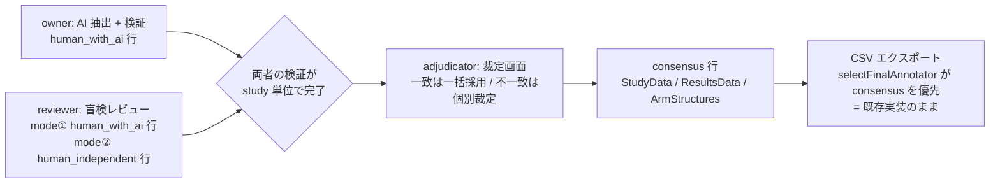

# 独立二重レビュー機能 設計書（issue #44 / 案 A）

- **作成日**: 2026-07-11（v0.1 ドラフト・レビュー待ち）/ **ステータス**: v0.2・**実装済み**（2026-07-11。フェーズ 1〜3 = PR 相当のコミット d9d5c72 / 3816ccc / 61be220 / 6f050be 完了。jest 144 suites / 2042 tests green・カバレッジ 100%・E2E 64 本 green。**2 アカウントでの実機通し確認〔§7.3 のスパイク含む〕は未実施**。設計からの逸脱・実装結果は §13 を参照）
- **対象 issue**: [#44 独立した第 2 の human reviewer による盲検レビュー](https://github.com/youkiti/sr-data-extraction-plugin/issues/44)
- **前提決定**: 盲検化は**案 A（同一スプレッドシート共有 + アプリ内盲検）**で行う。サテライトシート分離（案 B）は採用しない
- **位置づけ**: requirements.md §7 P1「二重独立抽出 + 不一致解決画面」（※Q4）の詳細設計。採用時は requirements.md を v0.11 へ改訂する（§11 参照）

## 0. 方針要約

1 プロジェクト（= 1 スプレッドシート = 1 Drive フォルダ）を第 2 レビュアーと**そのまま共有**し、盲検はアプリの表示制御で担保する。データ構造は現行の annotator 軸（`annotator` = email / `annotator_type` = `ai` / `human_with_ai` / `human_independent` / `consensus`）が最初から受け皿として設計済みのため、**タブ 1 枚の新設と consensus 行のキー規約の確定以外、シート構造は変更しない**。

issue の 3 モードは次の対応になる：

| issue のモード | annotator_type | 実装 |
|---|---|---|
| ① AI の結果をレビュー | `human_with_ai` | 既存の検証フローがほぼそのまま動く（§5） |
| ② AI 抜きのレビュー | `human_independent` | 検証パネルの「独立入力モード」を新設（§6） |
| ③ ヒトの不一致のレビュー | `consensus` | 裁定画面 `#/adjudicate` を新設（§7） |

**盲検の担保範囲**: 本設計の盲検は「アプリを通して作業する限り、他レビュアーの判定・値が一切表示されない」こと。Google Sheets を直接開けば見える点は構造上防げないため、**運用ルール（レビュー protocol への明記）で補完する**。この割り切りは案 A 採用時の合意事項。

## 1. ロールモデル

| ロール | 誰か | できること |
|---|---|---|
| **owner** | `Meta.created_by` と一致する email | 全画面（現行どおり）+ レビュアー管理（§8.1）+ 裁定（既定で adjudicator を兼務） |
| **reviewer** | `Reviewers` タブに登録された email | Home（縮退版）+ 検証のみ。`review_mode` により ①（`with_ai`）/ ②（`independent`）に分岐 |
| **adjudicator** | `Reviewers` タブで指定（省略時 = owner） | reviewer の権能 + 裁定画面 `#/adjudicate` |

ロール解決はメインビュー起動時に 1 回行う：ログイン email が `Meta.created_by` と一致 → owner。`Reviewers` の有効行に一致 → その role。**どちらでもない → 「このプロジェクトのレビュアーとして登録されていません」の全画面エラーで読み込みを中断**（共有はされているが未登録、のケースを防ぐ）。

## 2. データ設計の変更

### 2.1 `Reviewers` タブの新設（14 → 15 タブ）

レビュアー割り当てとモードの置き場。**追記型・email ごとに最新行が有効**（latest-wins。上書きしない方針は他タブと同じ）。

| 列 | 型 | 必須 | 説明 |
|---|---|---|---|
| email | string | ✓ | レビュアーの Google アカウント |
| role | enum | ✓ | `reviewer` / `adjudicator` / `revoked`（解除も追記で表現） |
| review_mode | enum | | `with_ai` / `independent`。role = `reviewer` のとき必須 |
| assigned_by | string | ✓ | 割り当て操作を行った owner の email |
| assigned_at | ISO8601 | ✓ | |

- owner 自身は登録不要（`Meta.created_by` で解決）。
- **モード変更は原則禁止**（`independent` → `with_ai` へ変えると盲検が事後的に破れるため）。UI では既存判定がある email のモード変更時に警告 + 監査行が残る（追記型なので履歴は自動的に残る）。
- 旧プロジェクトにはタブが無い → 書き込み時に自動作成（`ArmStructures` 導入時の `sheets.addSheetTab` パターンを踏襲）。読み出しでタブ欠如は「登録なし」として扱う。

### 2.2 consensus 行のキー規約

`StudyData` / `ResultsData` / `ArmStructures` の consensus 行は **`annotator` にリテラル `'consensus'` を使う**（`'ai'` と同格の予約値）。

- 理由: 更新キーが `study_id × annotator`（+ entity_key × field_id）のため、裁定者の email を annotator にすると「裁定者交代で consensus 行が 2 系統できる」。`selectFinalAnnotator` は consensus 重複を選定不能（null）として弾く実装なので、リテラル固定で一意性を構造的に保証する。
- **誰が裁定したかは `Decisions.decided_by` が監査する**（既存設計のとおり。`Decisions.annotator` = 判定対象行 = `'consensus'`、`decided_by` = 裁定者 email）。
- requirements.md §3.2 の「annotator: 人間は email、AI 抽出行は `ai`」に「consensus 行は `consensus`」を追記する。

### 2.3 変更しないもの

- `StudyData` / `ResultsData` / `Decisions` / `ArmStructures` / `Evidence` の列構造（annotator 軸で既に対応済み）
- `DecisionAction` の enum（裁定も `accept` / `edit` / `not_reported` / `undo` の読み替えで足りる。§7.5）
- エクスポート（`selectFinalAnnotator` が consensus 優先 → 唯一 human の順で既に実装済み。consensus 行が現れた瞬間に自動で切り替わる）

## 3. 盲検ガード（アプリ内の漏えい面の遮断）

「reviewer に他人の判定・値・進捗を見せない」を面で列挙し、それぞれの遮断方法を確定する。

| 漏えい面 | 現状 | 対応 |
|---|---|---|
| 検証パネルのセル状態 | **対応済み**。`verificationPanel` は `data.annotator` 一致の Decisions だけを畳み込む（ownDecisions） | 変更なし |
| 進捗チップ / ダッシュボード集計 | **対応済み**。`verifyService` / `dashboard.ts` とも ownDecisions ベース | 変更なし |
| `#/export`（audit.csv に全 annotator の判定が載る） | 全ロールが到達可能 | **reviewer には非表示**（§3.1 のシェル制限） |
| `#/extract` / `#/pilot` / `#/dashboard` / `#/documents` / `#/protocol` / `#/schema` | 同上 | **reviewer には非表示**。①検証に不要 ②mode② では AI の実行状況・anchor 率自体が盲検対象 ③編集系（文献・スキーマ）は owner の責務、の 3 点から一律で隠す |
| Home の進捗カウント | Decisions 総数などが見える（値は見えない） | reviewer には**縮退版 Home**（プロジェクト名 + 自分の検証進捗 + 検証への導線のみ）を出す |
| mode② への AI 情報 | — | Evidence・ハイライト・AI 値・AI ドラフト（群構成）を独立入力モードで一切描画しない（§6） |
| スプレッドシートの直接閲覧 | 防げない | 運用ルール（protocol 明記）。設計上のスコープ外と明記 |

### 3.1 reviewer 用シェル

`bootstrap` のロール解決結果を `AppState.role`（`owner` / `reviewer_with_ai` / `reviewer_independent` / `adjudicator`）に置き、ナビゲーション構築と `guardRoute` に食わせる：

- **reviewer**: ナビは `#/home`（縮退版）と `#/verify` のみ。他ルートへの直接 hash 遷移は `guardRoute` で `allowed: false`（「このプロジェクトではレビュアー権限のため利用できません」）。
- **adjudicator**: reviewer + `#/adjudicate`。
- **owner**: 現行どおり全ルート + `#/adjudicate`（既定で adjudicator 兼務のため）+ Home にレビュアー管理カード。

`#/verify` の入場ガードは mode で分岐：mode① は現行どおり `evidenceRows ≥ 1`。**mode② は Evidence 非依存**なので `schemaVersions ≥ 1 かつ studies ≥ 1` に差し替える。

## 4. モード①: AI 結果のレビュー（reviewer / `with_ai`）

**新規実装はほぼ無い**。reviewer が自分の Google アカウントでログインすると：

- `loadVerificationBundle` が `annotator` = 自分の email で束を組む → セルは全て未検証（空）から開始（automation bias 対策の既存原則がそのまま独立性を担保）
- 判定は自分の `human_with_ai` 行の upsert + Decisions 追記（既存経路。オフラインキューも `spreadsheetId × userEmail` 分離済み）
- 群構成も自分の `ArmStructures` 版系列を確定する（AI ドラフトからの編集で可 — mode① は AI を見てよい）

差分は §3 のシェル制限とロール解決だけ。

## 5. モード②: AI 抜きのレビュー（reviewer / `independent`）

### 5.1 対象一覧（Evidence 非依存）

現行 `#/verify` の対象一覧は「最新 run の Evidence がある study」から組むが、独立モードでは **`Studies` × 最新確定スキーマ**から組む（AI 抽出の有無・実施状況を見せない）。`readVerifyTargetMaterials` に独立モード分岐を追加し、`evidence: []` で束を返す。

### 5.2 独立入力モード（検証パネルの新モード）

`verificationPanel` に `panelMode: 'review' | 'independent'` を追加：

- **描画しない**: Evidence quote・ハイライト・「他 n 箇所に一致」・AI 値のプレフィル・anchor failed バナー
- **残す**: PDF ビューア（ページ送り / ズーム / **テキスト検索** — 自力で根拠を探す道具）、フォーカスモードのマトリクス、フィールドのラベル + extraction_instruction（何を抽出するかの定義はスキーマ由来であり AI 出力ではないため表示可）
- **操作**: `入力`（値を直接入力 → `action='edit'`）/ `not_reported` / `undo` の 3 種。`accept` / `reject` は AI 値が無いので出さない（キーボード a / x も無効化）
- **書き込み**: `annotator_type='human_independent'` で自分の annotator 行 upsert + Decisions 追記。経路は既存と同一で、現在 4 箇所にハードコードされている `'human_with_ai'`（verificationPanel / verifyService / pilotService / armStructureRepository 呼び出し）を bundle の `annotatorType` に差し替える

### 5.3 群構成と outcome インスタンス

- 群構成: AI ドラフト（`armDraft`）を**表示しない**。空の行追加 UI から自分で確定 → 自分の `ArmStructures` 版系列へ `annotator_type='human_independent'` で追記
- outcome_result インスタンス: 既存の宣言機構（`instanceDeclarations` = 予約 field_id `__entity_instance__` の Decisions 追記）をそのまま使い、自己申告で行を増やす。`buildOutcomeDeclarationDecisions` の `annotatorType` 固定値も bundle 由来へ差し替え

## 6. モード③: 不一致レビュー = 裁定画面 `#/adjudicate`（S12）

### 6.1 入場と単位

- adjudicator / owner のみ。**study 単位**で裁定する（検証・抽出と同じ単位）
- study ごとのゲート: **対象 2 annotator（owner + reviewer）の検証進捗が 100% になった study だけ開始可**。未完了 study は一覧でディム + 進捗表示（両者の「完了 / 未完了」だけを見せ、値・判定内訳は見せない — 裁定開始までは盲検を維持）

### 6.2 群構成の突き合わせ（セル裁定の前提）

arm 別セルは `entity_key`（`arm:n` / `outcome:...:arm:n`）で突き合わせるため、先に consensus 群構成を確定する：

1. 両者の最新 `ArmStructures` を並べて表示（`arm:1` ↔ `arm:1` の**位置対応**。並べ替えマッピング UI は将来拡張とし、v1 は位置対応固定）
2. 本数・名称が一致 → 「このまま採用」1 クリック。不一致 → 裁定者が consensus の本数・名称を編集して確定
3. `ArmStructures` へ `annotator='consensus'` / `annotator_type='consensus'` の版として追記

RoB タブ（`rob_domain`）と study タブは群構成に依存しないため、群構成確定前でも裁定可（検証画面の `isArmDependentLevel` と同じ規約）。

### 6.3 セル突き合わせと一致判定

- 素材: `StudyData` / `ResultsData` の owner 行 vs reviewer 行（= 各セルの**現在値**。判定履歴ではなく確定値を比べる）
- セル集合: 両者の entity_key の**和集合**。片側にしかないセル（インスタンス宣言の差）は相手側を「未入力」として不一致扱い
- **一致判定は trim 後の完全文字列一致**（`not_reported` トークン同士も一致）。数値の表記ゆれ（`12.5` vs `12.50`）の同一視は v1 ではやらない（§12 Q-b）
- schema_version が両行で異なるセルは警告バッジ付きで不一致側に列挙（改訂 → 再検証の促し）

### 6.4 裁定 UI

2 ペイン構成（検証画面の骨格を流用）：

- 左: セル一覧。「不一致のみ」フィルタ既定 ON。各行 = フィールド名 / owner の値 / reviewer の値 / 状態チップ
- 右: PDF ビューア（既存 `pdfViewer` + study の文書切替タブをそのまま流用）。**裁定フェーズは盲検解除後なので、AI の Evidence ハイライトと両者の判定メモ（`Decisions.note`）を表示してよい**（根拠探しの補助）
- セルごとの裁定アクション: **A を採用 / B を採用 / 第 3 の値を入力 / not_reported / スキップ**（スキップ = consensus セルを作らない。片側だけのインスタンスを「採用しない」場合に使う）
- 一致セルは「**一致セルを一括採用**」ボタンで 1 操作確定（1 セル = 1 Decisions 行を batch 追記。automation bias 対策の「1 操作必須」原則は一括操作 1 回で満たすと整理する）

### 6.5 書き込み

- consensus 行の upsert: `annotator='consensus'` / `annotator_type='consensus'`（更新キーの一意性は §2.2）
- Decisions 追記: `decided_by` = 裁定者 email / `annotator='consensus'`。action の読み替え —「A・B 一致の一括採用」= `accept`、「どちらか採用・第 3 の値」= `edit`、「not_reported 裁定」= `not_reported`、取り消し = `undo`（cellState の畳み込みがそのまま効く）
- エクスポートは変更不要（§2.3）。consensus 行が揃った study から study_wide.csv が consensus 値になる

## 7. マルチユーザーアクセス（オンボーディング）

### 7.1 owner 側: レビュアー管理カード（Home）

1. アプリ側の登録: email + role + review_mode を入力 → `Reviewers` へ追記
2. **Drive の自動共有（2026-07-11 改訂）**: 登録確定と同時に、アプリがスプレッドシート（**編集者** = 判定行・Decisions の書き込みに必要）とプロジェクトフォルダ（**閲覧者** = PDF 読み取り）を対象 email へ共有する（Drive `permissions.create`）。**追加スコープは不要** — `drive.file` スコープでも「アプリが作成・操作したファイル」には権限付与でき（tiab-review-plugin の `addPermission` が同方式で実運用済み）、本アプリのフォルダは `createFolder`、スプレッドシートは `moveFileToFolder` でいずれもアプリが Drive 操作済みのため対象になる。共有失敗（クロスドメイン制限等）は登録行を残したまま警告トーストで手動共有を案内する縮退動作
3. 招待情報（スプレッドシート ID）をコピーして reviewer へ渡す

> 旧設計（〜2026-07-11）は「Drive 共有 API には追加スコープが要るためアプリからは行わず案内のみ」としていたが、これは誤りで `drive.file` で共有可能なため自動共有へ変更した（§13）。

### 7.2 reviewer 側: 初回オンボーディング

1. 拡張をインストール → 自分の Google アカウントでログイン
2. Popup の「既存 ID」でスプレッドシート ID を入力 → `loadExistingProject` が Meta を読む（Sheets API はフル `spreadsheets` スコープのため共有シートは ID で開ける）
3. ロール解決 → reviewer と判明
4. **フォルダアクセス付与ステップ**: `drive.file` スコープでは他人が作成したファイルのバイナリを読めないため、Picker でプロジェクトフォルダを選択して本アプリに権限を付与する（S3 フォルダ取り込みと同じ Picker 経路を流用した専用画面を Home に出す。PDF が読めるようになるまで検証入場をブロック）

### 7.3 技術リスク（最優先の実機確認項目）

**Picker でプロジェクトフォルダ（他人がオーナー）を選択したとき、`drive.file` スコープで配下ファイルの `files.get?alt=media`（PDF バイナリ / extracted_texts）まで読めるか**は Google の仕様が曖昧。S3 のフォルダ取り込みで「選択フォルダ直下の列挙 + コピー」の実績はあるが、共有フォルダ + 孫階層（`pdfs/` / `extracted_texts/`）の読み出しは未検証。

- フォールバック 1: サブフォルダ（`pdfs/` / `extracted_texts/`）を個別に Picker 選択させる
- フォールバック 2: Picker のファイル複数選択で全 PDF を明示付与
- フォールバック 3（最終手段）: `drive.readonly` スコープの追加（Chrome Web Store / OAuth 審査の負担が大きいため回避したい）

**実装フェーズ 1 の最初にスパイクで検証する**（ここが崩れると reviewer の PDF 表示が成立しない）。なお extracted_texts が読めれば、PDF 描画なしのテキスト表示フォールバックで検証自体は続行可能（mode② はハイライト不要なので特に成立しやすい）。

## 8. 画面・状態の追加一覧（ui-states.md へ転記する骨子）

| 画面 | 状態 |
|---|---|
| Home（reviewer 縮退版） | ロール解決中 / 未登録エラー / フォルダ権限未付与（Picker 導線）/ 通常（自分の進捗 + 検証導線） |
| Home（owner レビュアー管理カード） | 一覧 / 追加フォーム / モード変更警告 / 解除確認 |
| `#/verify`（mode② 独立入力） | 既存 5 状態と同じ + Evidence 非表示・入力系操作のみの differences |
| `#/adjudicate` | 読み込み中 / 失敗 / study 一覧（両者進捗 + ゲート）/ 群構成突き合わせ / セル裁定（一致一括採用・不一致個別）/ study 完了 |

## 9. 実装分割（3 PR + 事前スパイク）

| # | 内容 | 主な新規モジュール |
|---|---|---|
| PR 0（スパイク） | §7.3 の drive.file 実機検証。結果次第でオンボーディング設計を確定 | tools/ 配下の検証スクリプト or 手動手順書 |
| PR 1 | `Reviewers` タブ + ロール解決 + reviewer シェル制限 + オンボーディング（owner 管理カード / reviewer フォルダ付与）+ **mode① 成立** | `domain/reviewer.ts` / `features/project/reviewerRepository.ts` / `app/services/roleService.ts` / guards・bootstrap・homeView 改修 |
| PR 2 | mode② 独立入力モード | `verificationPanel` の panelMode / `verifyService` の独立分岐 / annotator_type のハードコード解消 |
| PR 3 | mode③ 裁定画面 + consensus 書き込み | `features/adjudication/`（突き合わせ・一致判定・consensus upsert）/ `app/services/adjudicationService.ts` / adjudicateView / ルート追加 |

テスト方針（test-strategy.md 準拠）：

- jest: ロール解決 / 盲検ガード（reviewer で各ルートが `allowed: false`）/ 一致判定の正規化 / consensus キー規約 / `selectFinalAnnotator` との整合（既存テストに consensus ケース追加）— カバレッジ 100% 維持
- E2E: `app-reviewer.spec.ts`（reviewer ログイン → シェル制限 → mode① 判定 → 自分の行だけに書き込み）/ `app-independent.spec.ts`（mode② で Evidence 非表示 + 直接入力 → `human_independent` 行）/ `app-adjudicate.spec.ts`（ゲート → 群構成 consensus → 一括採用 + 個別裁定 → consensus 行 + Decisions 追記の実弾検証）+ 各 axe
- 実機: 2 アカウントでの共有 → 付与 → 検証 → 裁定 → エクスポートの通し（manual-testing.md へ §追加）

## 10. ドキュメント更新一覧（採用時）

- requirements.md → v0.11: `Reviewers` タブ（14 → 15）/ annotator 予約値 `consensus` / §4 に S12 裁定画面と S8 独立入力モード / §7 の P1「二重独立抽出 + adjudication」を MVP 昇格 or 本設計参照へ / Q4 の運用詳細
- ui-flow.md: ロール別ナビ + `#/adjudicate` ルート + reviewer オンボーディングフロー
- ui-states.md: §8 の状態マトリクス
- manual-testing.md: 2 アカウント通し手順
- CLAUDE.md: フェーズ記述の更新

## 11. スコープ外（明示）

- サテライトシートによるハード盲検（案 B）— 不採用決定
- 3 人以上のレビュアー / 担当セット分割（tiab-review の担当セット思想の移植は将来）
- 一致率 / κ 統計の表示（裁定画面のサマリに件数のみ。統計量は P2）
- arm の並べ替えマッピング UI（v1 は位置対応固定）
- ~~Drive 共有操作のアプリ内実行（追加スコープ回避のため案内のみ）~~ → **2026-07-11 にスコープ外から撤回し実装**（§7.1・§13。`drive.file` で共有可能と判明したため）
- 解除（revoked）時の自動アンシェア（他人の Drive アクセスを消す破壊的操作のため v1 は追加のみ。必要なら将来対応）

## 12. 未決定事項（レビューで確認したい点）

| # | 論点 | 起案 |
|---|---|---|
| Q-a | mode② の対象一覧に AI 抽出済みバッジ等を見せるか | 見せない（AI の実施状況も盲検対象とみなす） |
| Q-b | 一致判定で数値の表記ゆれ（`12.5` / `12.50`）を同一視するか | v1 は trim 完全一致のみ。不一致に出てきたら裁定 1 クリックで済むため過剰実装を避ける |
| Q-c | adjudicator を owner 以外にできるか | 構造上は可能（Reviewers の role）。v1 の UI 既定は owner |
| Q-d | reviewer 作業中に owner がスキーマ改訂した場合 | 裁定画面で schema_version 不一致セルに警告バッジ。ブロックはしない |
| Q-e | reviewer の作業完了を owner へ通知する手段 | v1 は裁定画面の進捗表示のみ（プッシュ通知等は持たない） |

## 13. 実装結果と設計からの逸脱（2026-07-11）

フェーズ 1〜3（コミット d9d5c72 / 3816ccc / 61be220 / 6f050be）の実装で確定した、本設計からの意図的な逸脱・追加判断を記録する。

- **ガードの counts 非依存化（§3.1 からの逸脱）**: §3.1 は mode② の `#/verify` 入場ガードを「`schemaVersions ≥ 1 かつ studies ≥ 1`」へ差し替えるとしていたが、reviewer 系ロールは盲検のため `loadProgressCounts` を一切呼ばず `state.counts` が常に初期値（全 0）のままになる。この設計どおりに実装すると `evidenceRows ≥ 1` 等の counts 依拠条件が reviewer には恒久的に `false` となり、フォルダアクセスを付与していても `#/verify` へ永久に入れないバグになることを監査で発見。**reviewer 系ロールは `#/verify` を含め counts ベースの判定を一切行わず、フォルダアクセス付与のみをゲートにする**よう変更した（`src/app/guards.ts`）。「AI 抽出未実施」「確定スキーマ無し」は検証画面（`verifyService` の読込結果）内の空状態表示に譲る
- **v1 の簡略化（§6.4・§9・§11 で予告済みの範囲を実装でも維持）**: 裁定画面の PDF ペインは表示 + ページ送り / ズーム / テキスト検索のみとし、Evidence ハイライトの再特定・`Decisions.note` の表示は実装しなかった（`app/views/adjudicatePdfPane.ts`。盲検解除後の工程で根拠探しは本文検索で足りると判断）。arm の並べ替えマッピング UI・一致率 / κ 統計・3 人以上の reviewer 対応は未実装（設計どおりスコープ外）。裁定の書き込み失敗時は `lib/storage/offlineQueue` への退避を実装せず、トースト表示のみに留めた（§9 のテスト方針は offlineQueue 共有を前提としていたが、v1 は他画面ほど頻度の高くない裁定操作のためオフライン耐性を後回しにした判断）
- **裁定一覧に annotator の email を表示する判断**: §6.1 は「両者の完了状況（n/m）のみを見せ、値・判定内訳は見せない」としていたが、この「完了状況」の内訳表示（`#adjudicate-list`）では A / B の区別のために各 annotator の email を併記している（値そのものは見せないため盲検の担保範囲は維持できると判断。email は元々 owner が `Reviewers` へ登録した情報であり新規の漏えいではない）
- **Drive 自動共有の後付け実装（§7.1・§11 の設計判断の撤回。2026-07-11）**: 当初は「Drive 共有 API には追加スコープが要る」との誤認からアプリ内共有を見送り案内文言のみとしていた。実機テストで owner が登録しても reviewer にシート/フォルダが共有されず手間がかかる指摘を受け再検討したところ、`drive.file` スコープでもアプリが作成・操作したファイルには `permissions.create` で共有可能（tiab-review-plugin の `addPermission` が同スコープで実運用済み）と確認できたため、レビュアー登録確定時にスプレッドシート（編集者）＋プロジェクトフォルダ（閲覧者）を自動共有する実装を追加した（`lib/google/drive.ts` の `shareFileWithUser`、`app/services/reviewerAdminService.ts` の既定 `shareProjectWithReviewer`）。共有失敗は登録行を残したまま警告に縮退。解除時の自動アンシェアは破壊的なため見送り
- **未実施の確認事項**: 2 アカウント（owner + reviewer）を使った実機通し確認（§7.3 の drive.file スコープでの共有フォルダ配下読み出しスパイクを含む）は未実施。`docs/manual-testing.md` に確認手順を追記済みだが、実施は今後のタスク
