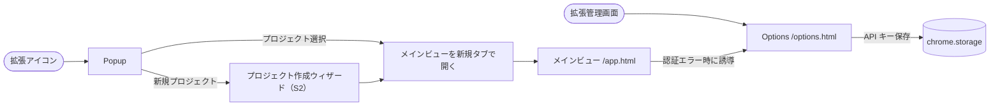
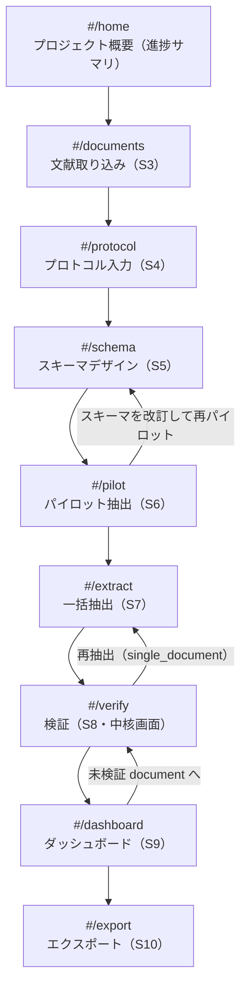
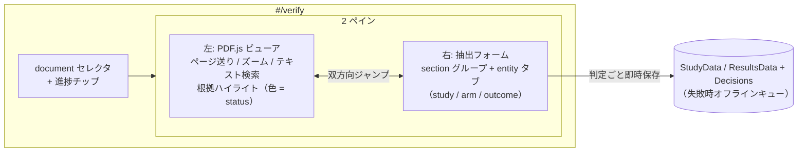

# UI 画面遷移図モック（v0.1）

- **作成日**: 2026-07-02
- **対象**: sr-data-extraction-plugin の Chrome 拡張内ルーティング
- **位置づけ**: [requirements.md §4.1](requirements.md) の画面一覧（S1〜S11）を画面遷移として具体化するモック。実装フェーズで詳細レイアウトを詰める
- **参照**: sr-query-builder-plugin の [docs/ui-flow.md](../sr-query-builder-plugin/docs/ui-flow.md) と同構成

## 1. 起動経路と全体ルーティング

Chrome 拡張は 3 つのエントリポイントを持つ（sr-query-builder と同方式）：

| エントリ | 役割 | 実装 |
|---|---|---|
| Popup（S1） | プロジェクト選択 + 「メインビューを開く」ボタン。最近のプロジェクト一覧と新規作成 | `popup.html`（拡張アイコンクリック） |
| メインビュー | フルページの作業画面。本拡張の作業はほぼここで完結 | `app.html`（`chrome.tabs.create` で開く） |
| Options（S11） | API キー設定、既定 LLM プロバイダ（OpenRouter カスタムモデルは P1）、表示言語 | `options.html`（拡張管理画面から開く） |

- プロジェクト作成ウィザード（S2）はスプレッドシート + Drive フォルダ（`documents/` / `extracted_texts/` / `raw_protocols/` / `logs/llm/`）を生成する。tiab-review 引き継ぎ（Q2）は P1 のため、MVP のウィザードは「新規作成」のみ

## 2. メインビュー内ルーティング

メインビューはシングルページアプリ。左サイドバーのステップナビと右ペインの作業エリアで構成。ハッシュルーティング（`#/documents` 等）で各ステップへ遷移する。

### 各画面の責務

| ハッシュ | 画面名 | 主な操作 | 主要 Sheets タブ |
|---|---|---|---|
| `#/home` | プロジェクト概要 | プロジェクト名・文献数・現在の Protocol / Schema version・検証進捗の表示。各ステップへ移動 | `Meta` / `Documents` / `SchemaVersions` / `StudyData` / `ResultsData`（集計のみ） |
| `#/documents` | 文献取り込み（S3） | Drive Picker 起動 → PDF コピー + テキスト層抽出。著作権フリー / 利用許諾済みは事前確認の運用（画面上部に注意書きのみ、チェック UI なし）。文献一覧に `text_status`（`ok` / `partial` / `no_text_layer`）バッジと study_label（AI 提案・編集可）を表示 | `Documents` 追記 |
| `#/protocol` | プロトコル入力（S4） | 手入力 / `.md` / `.docx`。sr-query-builder の protocol 画面 UI を移植（再訪時の 3 モード分岐も踏襲） | `Protocol` 追記 |
| `#/schema` | スキーマデザイン（S5） | `draft-schema` skill 実行（プロトコル + サンプル論文 1〜3 本）→ 表形式エディタで項目の追加 / 削除 / 型変更 / `extraction_instruction` 編集 → 版として確定。版履歴の閲覧・過去版からの派生もここ | `SchemaVersions` / `SchemaFields` 追記, `LLMApiLog` |
| `#/pilot` | パイロット抽出（S6） | 対象 2〜3 本を選択 → `extract-data` skill 実行 → S8 と同じ検証 UI（埋め込み）で確認 → 「スキーマを改訂して再パイロット」導線 | `ExtractionRuns`（`pilot`）/ `Evidence` / `StudyData` / `ResultsData` |
| `#/extract` | 一括抽出（S7） | 対象文献選択（既定: 未抽出の全件）、モデル選択、**コスト概算表示 → 実行確認**、進捗バー、失敗文献のリトライ | `ExtractionRuns`（`full` / `single_document`）/ `Evidence` / `StudyData` / `ResultsData`, `LLMApiLog` |
| `#/verify` | 検証（S8） | §3 参照。document 選択 → 2 ペイン検証 | `StudyData` / `ResultsData`（自分の annotator 行の更新）+ `Decisions` 追記 |
| `#/dashboard` | ダッシュボード（S9） | document × section の検証進捗マトリクス、anchor 失敗率、not_reported 率。セルクリックで `#/verify` の該当 document / section へ | `StudyData` / `ResultsData` / `Evidence` / `Documents`（読み取りのみ） |
| `#/export` | エクスポート（S10） | 形式選択（study_wide / results_long / audit）、プレビュー、CSV 生成 + Drive 保存 + ダウンロード。未検証セル残存時は警告ダイアログ | `ExportLog` 追記 |

## 3. 検証画面（`#/verify`）の内部構造

[requirements.md §4.2](requirements.md) の 2 ペイン構成。URL は `#/verify?doc={document_id}&entity={entity_key}` で状態を保持し、ダッシュボードからの直接ジャンプを可能にする。

- **entity タブの順序**: `study` → `arm`（冒頭で arm 数・名称の確定 UI）→ `outcome_result`。arm 未確定のうちは arm / outcome タブをディム表示
- **anchor_status = failed の項目**: フォーム側に quote 全文 + 「本文内を検索」ボタン（PDF.js のテキスト検索へ quote を投入）
- **複数一致時**: 「他 n 箇所に一致」リンクでハイライトを切替
- **戻る操作**: 直近の判定履歴（項目単位）を戻せる（tiab-review の「直近 5 件履歴」を読み替えて移植）

## 4. 状態遷移とガード条件

各ステップへの遷移には前提条件があり、サイドバーで未充足ステップはディム表示にする：

| 遷移 | ガード | 未充足時の挙動 |
|---|---|---|
| `→ #/protocol` | なし（いつでも可） | — |
| `→ #/schema` | `Protocol` に少なくとも 1 行存在 | サイドバーでディム、クリック時はトーストで誘導 |
| `→ #/pilot` | 確定済み `schema_version` ≥ 1 **かつ** document ≥ 1（`no_text_layer` の document は `pdf_native` モードでのみ抽出対象 ※requirements.md Q7） | 同上 |
| `→ #/extract` | 確定済み `schema_version` ≥ 1 | パイロット未実施の場合は警告バナー（「パイロット抽出を推奨します」）を出すが遷移は許可 |
| `→ #/verify` | `Evidence` に少なくとも 1 行存在（AI 抽出実施済み） | サイドバーでディム |
| `→ #/dashboard` | なし（0 件でも空状態 UI） | — |
| `→ #/export` | `StudyData` / `ResultsData` に少なくとも 1 行存在 | サイドバーでディム。未検証セル残存はガードではなく警告ダイアログで扱う |

## 5. グローバル UI 要素

すべての画面に共通（sr-query-builder と同トンマナ）：

- **左サイドバー**: ステップナビ（Home → Documents → Protocol → Schema → Pilot → Extract → Verify → Dashboard → Export）。現在地ハイライト、未充足ステップはディム
- **トップバー**:
  - アプリタイトルをクリックで `#/home` に戻る。そこから「別のプロジェクトを開く」で Popup を新規タブ起動（二段遷移。sr-query-builder と同理由）
  - 現在のプロジェクト名 / `Protocol.version` / `schema_version`
  - LLM プロバイダ + 累積コスト（`LLMApiLog.cost_estimate` 合計）
  - オフライン時: 「オフライン: N 件キュー中」表示
- **右下フローティング**: 直近の `LLMApiLog` 通知トースト（成功 / エラー）。クリックで Drive のログ JSON を開く

## 6. エラー / オフライン時の遷移

| 事象 | UI 挙動 |
|---|---|
| OAuth 失効 | モーダル「Google 再認証が必要です」+ 再認証ボタン → `chrome.identity.removeCachedAuthToken` → 再取得 |
| Sheets API 権限不足 | モーダル「シートへの書き込み権限がありません」+ 共有設定への外部リンク |
| LLM API エラー（抽出中） | 該当 document の行に赤バッジ + 「再試行」。`ExtractionRuns.status = partial_failure` として記録 |
| PDF テキスト層なし | 取り込み時に `no_text_layer` バッジ + 「ハイライト検証は使えません（`pdf_native` 抽出のみ可）」の注記。`text_only` モードの実行時は選択 UI からグレーアウト |
| 判定保存失敗 | オフラインキューへ退避 + トップバーにキュー件数。復帰時に自動再送（tiab-review 準拠） |
| Drive ファイル消失（PDF が開けない） | ビューアに「原本が見つかりません」+ 再取り込み導線（Q9 のコピー方針により発生頻度は低い想定） |

## 7. キーボードショートカット適用範囲

`#/verify` 画面のみで有効（他画面では誤爆防止のため発火しない。tiab-review の判定 UI に準拠した操作感）：

- `a`: accept / `e`: edit（値入力へフォーカス）/ `x`: reject / `n`: not reported
- `j` / `↓`: 次の項目、`k` / `↑`: 前の項目
- `z`: 直近の判定を戻す
- `f`: 現在項目のハイライトへ PDF をスクロール（フォーカスジャンプ）

> キー割当は実装フェーズの操作感検証で最終確定する（tiab-review の i / e / m と揃えるかも含め）。

## 8. 実装フェーズで詰めるもの

- 検証画面 2 ペインの最小幅・分割比率（PDF ビューアは最小 600px 幅を想定。メインビューは最小幅 1280px）
- PDF.js ビューアの仮想化（100 ページ超の PDF でのページ描画戦略）
- entity タブ（arm / outcome）のインスタンス追加・削除 UI の詳細
- ハイライト色のトークン定義（検証済み = 緑系 / 未検証 = 黄系 / low confidence = 橙系。[requirements.md §5](requirements.md)）
- コスト概算の算出式（トークン単価テーブルの持ち方）
