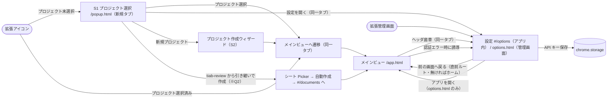
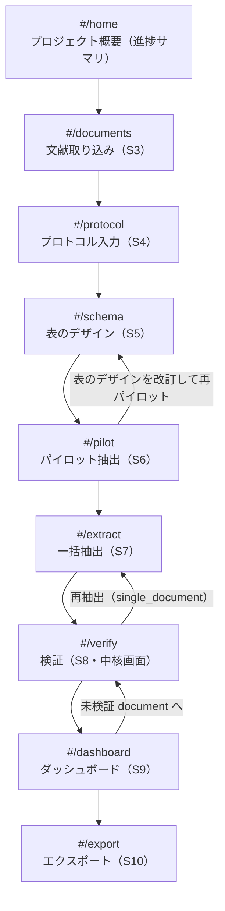
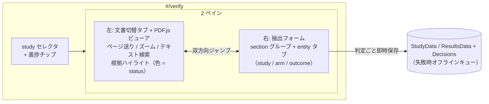

# UI 画面遷移図モック（v0.1）

- **作成日**: 2026-07-02
- **対象**: sr-data-extraction-plugin の Chrome 拡張内ルーティング
- **位置づけ**: [requirements.md §4.1](requirements.md) の画面一覧（S1〜S11）を画面遷移として具体化するモック。実装フェーズで詳細レイアウトを詰める
- **参照**: sr-query-builder-plugin の [docs/ui-flow.md](../sr-query-builder-plugin/docs/ui-flow.md) と同構成

## 1. 起動経路と全体ルーティング

Chrome 拡張は 3 つのエントリポイントを持つ（sr-query-builder と同方式）：

| エントリ | 役割 | 実装 |
|---|---|---|
| プロジェクト選択（S1） | プロジェクト選択（選択と同時に同一タブのままメインビューへ遷移する。独立した「開く」ボタンは持たない）。最近のプロジェクト一覧と新規作成 | `popup.html`（新規タブでフルページ表示。アンカー型ポップアップとしては使わない） |
| メインビュー | フルページの作業画面。本拡張の作業はほぼここで完結 | `app.html`（`chrome.tabs.create` で開く） |

拡張アイコンのクリックはポップアップを出さず、service worker の `action.onClicked` がその場で新規タブを開く（manifest に `default_popup` を持たない）: プロジェクト選択済みならメインビュー（`app.html`）、未選択（初回・ログアウト後）なら S1（`popup.html`）へ。
| Options（S11） | API キー設定、既定 LLM プロバイダ（OpenRouter カスタムモデルは P1）、表示言語 | `options.html`（拡張管理画面から開く）＋アプリ内ルート `#/options`（メインビューのヘッダ歯車・S1 の「設定を開く」から同一タブで遷移。本文マークアップは `options.html` と共通の `settingsSections.ts`） |

拡張管理画面の「拡張機能のオプション」からは従来どおり `options.html` が単独ページで開く（`manifest.options_page`）。作業中の導線は別タブを開かず、メインビュー内の `#/options` へハッシュ遷移して設定 ⇄ 各作業画面をサイドバーで行き来する。S1 の「設定を開く」も同一タブで `app.html#/options` へ遷移する。

- プロジェクト作成ウィザード（S2）はスプレッドシート + Drive フォルダ（`documents/` / `extracted_texts/` / `raw_protocols/` / `logs/llm/`）を生成する
- **tiab-review 引き継ぎ（※Q2）**: S1 の「tiab-review から引き継いで作成」から、tiab シートの Picker 選択（= drive.file 付与）→ include 検証 → プロジェクト自動作成（タイトル既定 = シート名）→ 同一タブで `app.html#/documents` へ直接遷移し、S3 の引き継ぎパネルで include の fulltext PDF 一括取り込み → 採用リスト反映プレビューまで案内する（状態仕様は [ui-states.md](ui-states.md) §1 / §3）

### reviewer オンボーディング（v0.11・独立二重レビュー機能 issue #44）

第 2 の human reviewer が初めてプロジェクトへ参加する経路（owner が Google 側の共有 + `Reviewers` への登録を済ませたあと）:

1. 拡張をインストールし、自分の Google アカウントでログイン
2. Popup（S1）の「既存 ID」でスプレッドシート ID を入力して開く。**drive.file スコープでは他人が作成したシートに最初はアクセスできない**（issue #130）ため、初回はアクセス拒否 → 「Google で許可する」→ スプレッドシート用 Picker で当該シートを選択（ユーザー × シートごと 1 回）→ 自動再試行で開く（状態仕様は [ui-states.md §1](ui-states.md) の「アクセス許可が必要」）
3. メインビュー起動時にロールを解決（下記「ロール別ナビゲーション」）→ reviewer / adjudicator と判明
4. Home（縮退版）の「プロジェクトファイルへのアクセスを付与」ボタンで Picker のファイル許可モード（`view=files` + `setFileIds`。issue #139）を開き、Documents タブ由来の必要ファイル（PDF + 抽出テキスト）を**全選択**してファイル単位で drive.file を付与 → 到達性を 1 件試し読み（抽出テキスト本文 / 無ければ先頭 PDF のメタデータ。伝播遅延に備え最大 3 回リトライ）→ `chrome.storage.local` にプロジェクト × アカウント単位のフラグを保存。旧方式（プロジェクトフォルダの選択）は、他人所有の共有フォルダでは配下ファイルへ付与されないことが実機で確定したため廃止（2026-07-18）
5. ファイルアクセス付与が済むと `#/verify`（adjudicator は `#/adjudicate` も）に入場できる（未付与のうちはガードでブロック）。付与後に owner が取り込んだ文献は付与済みフラグでカバーされないため、Home の「アクセスを付与し直す」で再付与する

owner 側の登録手順（レビュアー管理カード）・盲検の担保範囲・裁定 `#/adjudicate` の詳細は [docs/design-independent-dual-review.md](design-independent-dual-review.md) を参照。

## 2. メインビュー内ルーティング

メインビューはシングルページアプリ。左サイドバーのステップナビと右ペインの作業エリアで構成。ハッシュルーティング（`#/documents` 等）で各ステップへ遷移する。

### 各画面の責務

| ハッシュ | 画面名 | 主な操作 | 主要 Sheets タブ |
|---|---|---|---|
| `#/home` | プロジェクト概要 | プロジェクト名・文献数・現在の Protocol / Schema version・検証進捗の表示。各ステップへ移動 | `Meta` / `Documents` / `SchemaVersions` / `StudyData` / `ResultsData`（集計のみ） |
| `#/documents` | 文献取り込み（S3） | Drive Picker 起動 → PDF コピー + テキスト層抽出。画面上部に PDF の外部送信先（LLM API のみ）の注意書きを常時表示。文献一覧に `text_status`（`ok` / `partial` / `no_text_layer`）バッジと study_label（AI 提案・編集可）を表示 | `Documents` 追記 |
| `#/protocol` | プロトコル入力（S4） | 手入力 / `.md` / `.docx`。sr-query-builder の protocol 画面 UI を移植（再訪時の分岐は 新規フォーム / 読み取り専用 + 版切替 / 再入力フォーム の 3 モード。本拡張は LLM 抽出を挟まず送信 = 即保存のため「未保存下書き復元」モードは持たない）。md / docx の抽出テキストは Drive `raw_protocols/` へ退避 | `Protocol` 追記 |
| `#/schema` | 表のデザイン（S5） | `draft-schema` skill 実行（プロトコル + サンプル論文 1〜3 本）→ 表形式エディタで項目の追加 / 削除 / 型変更 / `extraction_instruction` 編集 → 版として確定。版履歴の閲覧・過去版からの派生もここ | `SchemaVersions` / `SchemaFields` 追記, `LLMApiLog` |
| `#/pilot` | パイロット抽出（S6） | 対象 2〜3 本を選択 → `extract-data` skill 実行 → S8 と同じ検証 UI（埋め込み）で確認 → 「表のデザインを改訂して再パイロット」導線 | `ExtractionRuns`（`pilot`）/ `Evidence` / `StudyData` / `ResultsData` |
| `#/extract` | 一括抽出（S7） | 対象文献選択（既定: 未抽出の全件）、モデル選択、**コスト概算表示 → 実行確認**、進捗バー、失敗文献のリトライ | `ExtractionRuns`（`full` / `single_document`）/ `Evidence` / `StudyData` / `ResultsData`, `LLMApiLog` |
| `#/verify` | 検証（S8） | §3 参照。document 選択 → 2 ペイン検証 | `StudyData` / `ResultsData`（自分の annotator 行の更新）+ `Decisions` 追記 + `ArmStructures` 追記（群構成の確定） |
| `#/dashboard` | ダッシュボード（S9） | document × section の検証進捗マトリクス、anchor 失敗率、not_reported 率。セルクリックで `#/verify` の該当 document / section へ | `StudyData` / `ResultsData` / `Evidence` / `Documents`（読み取りのみ） |
| `#/export` | エクスポート（S10） | 形式選択（study_wide / results_long / audit）、プレビュー、CSV 生成 + Drive 保存 + ダウンロード。未検証セル残存時は警告ダイアログ | `ExportLog` 追記 |
| `#/adjudicate` | 裁定（S12・v0.11） | owner / adjudicator のみ。human annotator 2 名の検証が揃った study を選択（3 名以上の study は一覧のペア選択で裁定する 2 名を選ぶ。issue #63）→ 群構成の突き合わせ（arm 並べ替えマッピング付き）→ セル一覧（一致は一括採用・不一致は個別裁定）→ `consensus` 確定 | `ArmStructures` / `StudyData` / `ResultsData`（consensus 版の追記）+ `Decisions` 追記 |

### ロール別ナビゲーション（v0.11・独立二重レビュー機能 issue #44）

メインビュー起動時にログイン email のロール（`owner` / `reviewer_with_ai` / `reviewer_independent` / `adjudicator` / `unregistered`）を 1 回解決し、ロールに応じてサイドバーに出すルートを制限する（ディムではなく非表示）:

| ロール | 見えるルート |
|---|---|
| `owner` | 全ルート（`#/adjudicate` 含む。owner は既定で adjudicator を兼務） |
| `reviewer_with_ai` / `reviewer_independent` | `#/home`（縮退版）+ `#/verify` のみ |
| `adjudicator` | `#/home`（縮退版）+ `#/verify` + `#/adjudicate` |

**ロール解決のフェイルクローズ**: プロジェクト選択済みでロールが未確定（解決中・解決失敗・`Meta.created_by` にも `Reviewers` にも一致しない未登録）の間は、owner 向けの UI・データ読込を一切開放せず、以下の全画面ブロックだけを表示する（ルートのローダ自体も発火しない）:

- 解決中: 「このプロジェクトでのロールを確認しています…」
- 解決失敗: 「このプロジェクトでのロールを確認できませんでした: {理由}」+ 再試行ボタン（一時的なエラーで owner 側へフォールバックしない）
- 未登録（`unregistered`）: 「このプロジェクトのレビュアーとして登録されていません。プロジェクトのオーナーに登録を依頼してください。」

## 3. 検証画面（`#/verify`）の内部構造

[requirements.md §4.2](requirements.md) の 2 ペイン構成。URL は `#/verify?study={study_id}&entity={entity_key}` で状態を保持し、ダッシュボードからの直接ジャンプを可能にする（`?study=` は S8、`?entity=` は S9 ダッシュボードと同時に実装済み。2026-07-02。v0.10 フェーズ 3 で `?doc=` → `?study=` へ移行 = 2026-07-09）。study が複数の PDF を持つ場合は左ペイン上部に**文書切替タブ**（role バッジ + ファイル名）が出て、根拠クリック / 項目フォーカス時に `Evidence.document_id` が指す出所 PDF へ自動で切り替わる。

- **entity タブの順序**: `study` → `arm`（冒頭で arm 数・名称の確定 UI。確定内容は `ArmStructures` へ新 version として追記）→ `outcome_result`。arm 未確定（= `ArmStructures` に行なし）のうちは arm / outcome タブをディム表示
- **anchor_status = failed の項目**: フォーム側に quote 全文 + 「本文内を検索」ボタン（PDF.js のテキスト検索へ quote を投入）
- **複数一致時**: 「他 n 箇所に一致」リンクでハイライトを切替
- **戻る操作**: 直近の判定履歴（項目単位）を戻せる（tiab-review の「直近 5 件履歴」を読み替えて移植）

## 4. 状態遷移とガード条件

各ステップへの遷移には前提条件があり、サイドバーで未充足ステップはディム表示にする：

| 遷移 | ガード | 未充足時の挙動 |
|---|---|---|
| `→ #/protocol` | なし（いつでも可） | — |
| `→ #/schema` | `Protocol` に少なくとも 1 行存在 | サイドバーでディム、クリック時はトーストで誘導 |
| `→ #/pilot` | 確定済み `schema_version` ≥ 1 **かつ** document ≥ 1（`no_text_layer` の document は `pdf_native` モードでのみ抽出対象 ※requirements.md Q7） | 同上 |
| `→ #/extract` | 確定済み `schema_version` ≥ 1 | パイロット未実施の場合は警告バナー（「パイロット抽出を推奨します」）を出すが遷移は許可 |
| `→ #/verify` | `owner`: 確定済み `schema_version` ≥ 1 **かつ** document ≥ 1（`Evidence` の有無は問わない）。AI 抽出が全滅して `Evidence` が 0 行の study も S8 に「AI 抽出結果なし」として表示し人手入力へ進めるため、Evidence 起点の判定は入場ガードとしては使わない（抽出前に入った場合は一覧が空になり `#verify-empty` の空状態表示に委ねる）。**reviewer 系ロール（v0.11）**: counts を見ずフォルダアクセス付与済みのみを条件にする（盲検のため counts ベースの判定は行わない。「AI 抽出未実施」「確定スキーマ無し」は画面内の空状態表示に譲る） | サイドバーでディム。未充足時はトーストで案内 |
| `→ #/dashboard` | なし（0 件でも空状態 UI） | — |
| `→ #/export` | `StudyData` / `ResultsData` に少なくとも 1 行存在 | サイドバーでディム。未検証セル残存はガードではなく警告ダイアログで扱う |
| `→ #/adjudicate`（v0.11） | `owner` / `adjudicator` ロールのみ。counts による入場条件はなし（対象 study が無ければ画面内の空状態で案内） | それ以外のロールはナビ自体に表示されない |

## 5. グローバル UI 要素

すべての画面に共通（sr-query-builder と同トンマナ）：

- **左サイドバー**: ステップナビ（Home → Documents → Protocol → Schema → Pilot → Extract → Verify → Dashboard → Export）。現在地ハイライト、未充足ステップはディム
- **トップバー**:
  - アプリタイトルをクリックで `#/home` に戻る。そこから「別のプロジェクトを開く」（`#home-switch-project`）で S1 プロジェクト選択ページへ同一タブで遷移（二段遷移。sr-query-builder と同理由）
  - 現在のプロジェクト名 / `Protocol.version` / `schema_version`
  - LLM プロバイダ + 累積コスト（`LLMApiLog.cost_estimate` 合計）
  - オフライン時: 「オフライン: N 件キュー中」表示
- **右下フローティング**: 直近の `LLMApiLog` 通知トースト（成功 / エラー）。クリックで Drive のログ JSON を開く

## 6. エラー / オフライン時の遷移

| 事象 | UI 挙動 |
|---|---|
| OAuth 失効 | モーダル「Google 再認証が必要です」+ 再認証ボタン → `chrome.identity.removeCachedAuthToken` → 再取得 |
| Sheets API 権限不足 | モーダル「シートへの書き込み権限がありません」+ 共有設定への外部リンク |
| LLM API エラー（抽出中） | 該当 document の行に赤バッジ + 「再試行」。`ExtractionRuns.status = partial_failure` として記録 |
| PDF テキスト層なし | 取り込み時に `no_text_layer` バッジ + 「ハイライト検証は使えません（`pdf_native` 抽出のみ可）」の注記。`text_only` モードの実行時は選択 UI からグレーアウト |
| 判定保存失敗 | オフラインキューへ退避 + トップバーにキュー件数。復帰時に自動再送（tiab-review 準拠） |
| Drive ファイル消失（PDF が開けない） | ビューアに「原本が見つかりません」+ 再取り込み導線（Q9 のコピー方針により発生頻度は低い想定） |

## 7. キーボードショートカット適用範囲

検証パネル（S8 の 2 ペイン UI。S6 パイロットにも同一コンポーネントを埋め込む）が表示されている画面のみで有効（他画面では誤爆防止のため発火しない。tiab-review の判定 UI に準拠した操作感）。パネルは**フォーカス / リスト**の 2 レイアウトモードを持ち（既定はフォーカス。issue #38）、`j` / `k` / `h` / `l` の意味と `z` の対象セルがモードで異なる：

| キー | リストモード | フォーカスモード |
|---|---|---|
| `a` / `e` / `x` / `n` | フォーカス中セルへ accept / edit（値入力）/ reject / not reported | 同左 |
| `j` / `↓` | 次の項目（表示順） | 同一ユニット内の次の**行**（同じ列を維持。端で停止・null セルはスキップ） |
| `k` / `↑` | 前の項目（表示順） | 同一ユニット内の前の**行**（同上） |
| `h` / `←` | 無効 | 同一ユニット内の前の**列**（同じ行を維持。端で停止・null セルはスキップ） |
| `l` / `→` | 無効 | 同一ユニット内の次の**列**（同上） |
| `Shift+J` | 無効 | 次のユニットへ移動（判定状況に関係なく。着地は最初の未判定セル→無ければ先頭セル。端で停止） |
| `Shift+K` | 無効 | 前のユニットへ移動（同上） |
| `z` | フォーカス中セルの判定を戻す | **直近判定セル**（フォーカス中セルとは限らない。固定表示バー参照）の判定を戻す。ユニットをまたいでも効く |
| `f` | 現在項目のハイライトへ PDF をスクロール（フォーカスジャンプ） | 同左 |

判定キー（`a` / `e` / `x` / `n`）で判定を確定すると、次の未判定セルへ自動的にフォーカスが移る。リストモードは表示順で次の未判定セルへ（判定済みはスキップ・末尾まで無ければ先頭へ回り込む・全て判定済みなら留まる）。フォーカスモードは同一ユニット内の次の未判定セル→無ければ次の未判定ユニットの最初の未判定セル（末尾まで無ければ先頭ユニットへ回り込む）→それも無ければ留まる。初期フォーカスも「最初の未判定セル」（フォーカスモードは「最初の未判定ユニットの最初の未判定セル」）に当たる（ui-states.md §4）。連続判定で `j` を都度押す必要がなく、判定済みセルから作業が始まらない。

> キー割当は実装フェーズの操作感検証で最終確定する（tiab-review の i / e / m と揃えるかも含め）。

## 8. 実装フェーズで詰めるもの

- 検証画面 2 ペインの最小幅・分割比率（PDF ビューアは最小 600px 幅を想定。メインビューは最小幅 1280px）
- PDF ビューアのズーム段階は 75 / 100 / 125 / 150 / 175 / 200 / 250 / 300%（既定 100%）。スクロールで拡大表示を閲覧する（issue #51: #/pilot 埋め込み・#/verify 単独の両方で共有）
- PDF.js ビューアの仮想化（100 ページ超の PDF でのページ描画戦略）
- entity タブ（arm / outcome）のインスタンス追加・削除 UI の詳細
- ハイライト色のトークン定義（検証済み = 緑系 / 未検証 = 黄系 / low confidence = 橙系。[requirements.md §5](requirements.md)）
- コスト概算の算出式（トークン単価テーブルの持ち方）
